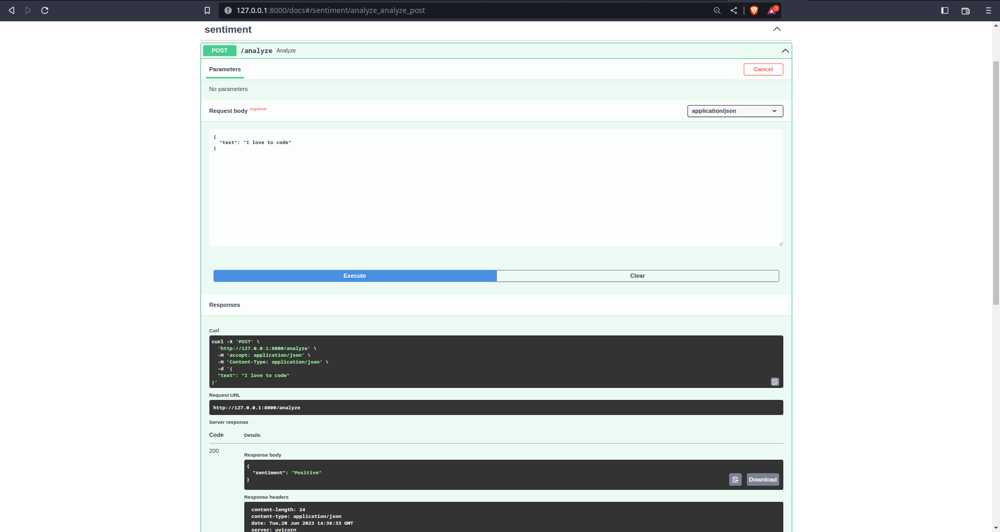

# sentiment_analysis

## create virtual Environment
        python -m venv <env_name>
## activate virtual Environment
        source <env_name>/bin/activate [Linux, Mac OS]
        <env_name>\Scripts\actiavte [Windows]

## install requirements
        pip install -r requirements.txt
## run server
        uvicorn app.main:app
## test the server
        open browser and type url: 127.0.0.1:8000/docs

